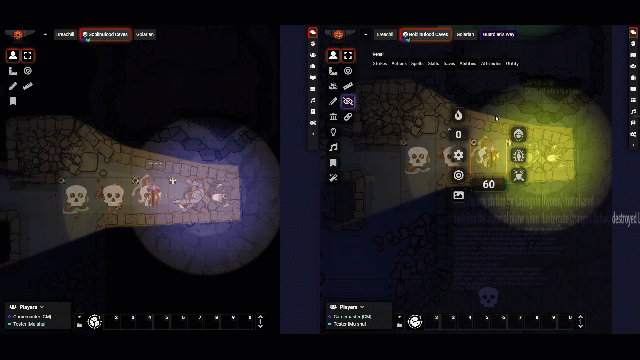

# Close Player Art


<a href="https://www.buymeacoffee.com/gsimon2" target="_blank"></a>

A simple module for [FoundryVtt](https://foundryvtt.com/) that adds the hot key ``` ` ``` (backtick) for the GM to close open image popouts on player screens.

-------------------- Player Screen  -------------------------------------------- Gm Screen --------------------

